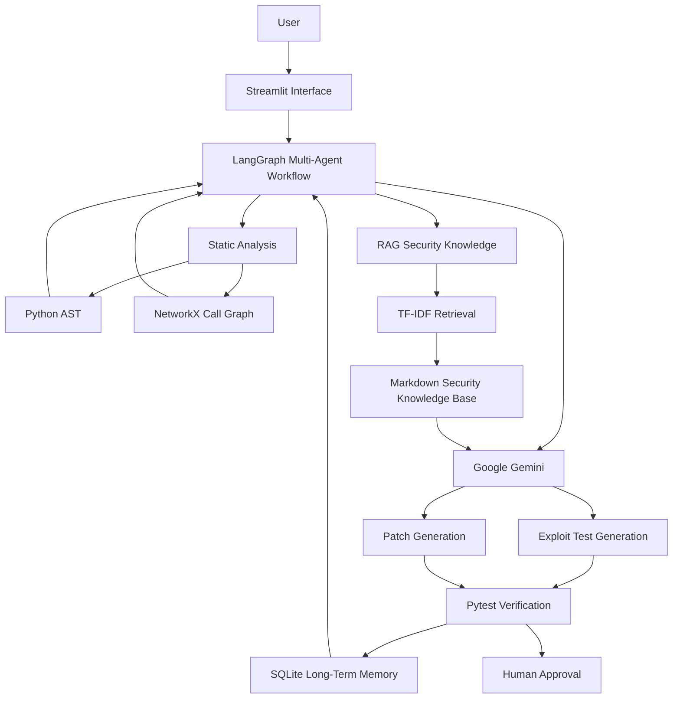
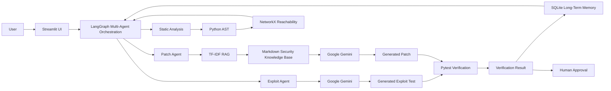

<div align="center">

# 🛡️ AegisGuard

### AI-Assisted Vulnerability Detection, Remediation & Verification

**Finds • Proves • Fixes • Verifies — with a human in control**

<br>


<br>

### 🚀 From Vulnerability Detection to Verified Remediation

AegisGuard combines **static analysis, multi-agent AI, RAG, automated verification, long-term memory, and human approval** into one application-security workflow.

---

### 🧭 Project Navigator

<div align="center">

[](#overview)
[](#the-problem)
[](#core-workflow)
[](#key-features)

[](#technology-stack)
[](#system-architecture)
[](#how-the-backend-components-connect)
[](#multi-agent-workflow)

[](#installation--setup)
[](#live-demo)
[](#security-notes)
[](#future-roadmap)

</div>

### ⚡ Core Security Flow

**TRIAGE → EXPLOIT → CONFIRM → PATCH → VERIFY → HUMAN APPROVAL**

| 🔍 Detect | 🧪 Prove | 🧠 Retrieve | 🔧 Patch | ✅ Verify | 👤 Approve |
|---|---|---|---|---|---|
| Static Analysis | Exploit Test | RAG Guidance | Gemini | Pytest | Human Review |

> **AI may propose the fix. Evidence should verify it. Humans should approve it.**

</div>

---

## The Problem

Finding a vulnerability is only the beginning.

Traditional security scanners may identify risky code, but developers still need to:

- Determine whether the issue is actually exploitable
- Understand the vulnerable execution path
- Reproduce the vulnerability
- Research the correct remediation
- Write a secure patch
- Test whether the patch blocks the attack
- Ensure existing functionality still works
- Review and approve the final code change

AI coding assistants can generate fixes quickly, but an AI-generated patch should not be considered secure simply because it looks correct.

**A security fix must be verified.**

---

## The Solution

AegisGuard provides a structured remediation pipeline:

**TRIAGE → EXPLOIT → CONFIRM → PATCH → VERIFY → HUMAN APPROVAL**

AegisGuard attempts to answer six key questions:

1. **Where is the risky code?**
2. **Can the vulnerability be reproduced?**
3. **What security guidance is relevant?**
4. **What remediation should be proposed?**
5. **Does the remediation actually work?**
6. **Should a human approve the final change?**

---

## Core Workflow

AegisGuard follows a concise six-stage remediation process:

**TRIAGE → EXPLOIT → CONFIRM → PATCH → VERIFY → HUMAN APPROVAL**

### 1. Triage
Uses **Python AST + NetworkX** to detect risky code, identify the vulnerable function, and inspect reachability.

### 2. Exploit
Uses **Gemini** to generate a targeted security regression test for trusted demo samples.

### 3. Confirm
Runs the generated test to confirm whether the suspected vulnerability can be reproduced.

### 4. Patch
Retrieves relevant **RAG security guidance** and uses Gemini to propose a remediation.

### 5. Verify
Uses **Pytest + static re-checking** to confirm that the attack is blocked and existing functionality still works.

### 6. Human Approval
Presents the verified remediation for final human review and approval.

### Core Concept

**🔴 RED → PATCH → 🟢 GREEN**

- **RED:** Vulnerability reproduced
- **PATCH:** Remediation generated
- **GREEN:** Security test and regression tests pass

## Key Features

- 🛡️ Static security scanning
- 📁 Python file and ZIP project upload
- 🤖 Multi-agent remediation workflow
- 🧠 RAG-grounded security guidance
- 🧪 AI-generated exploit tests
- 🔧 AI-assisted patch generation
- ✅ Automated security verification
- 🧾 Regression testing
- 💾 Long-term security memory
- 👤 Human-in-the-loop approval
- 📊 Run history
- 💬 Security Assistant

---

## Technology Stack

| Layer | Technology | Purpose |
|---|---|---|
| User Interface | **Streamlit** | Security dashboard, project upload, assistant, run history |
| Agent Orchestration | **LangGraph** | Multi-agent workflow, state, routing, retries |
| AI | **Google Gemini** | Exploit-test and patch generation |
| AI Integration | **LangChain Google GenAI** | Connects the application to Gemini |
| Static Analysis | **Python AST** | Source-code parsing and risky-pattern detection |
| Graph Analysis | **NetworkX** | Call graph and reachability analysis |
| RAG | **TF-IDF** | Retrieves relevant security guidance |
| Knowledge Base | **Markdown files** | Stores defensive security notes |
| Testing | **Pytest** | Security tests and regression verification |
| Memory | **SQLite** | Stores previous runs, fixes, failures, and outcomes |
| Demo Applications | **Flask** | Trusted sample applications |
| UI Theme | **Custom CSS + Streamlit Theme** | Professional dashboard styling |

---

## System Architecture



---

## How the Backend Components Connect

AegisGuard is built as a connected remediation workflow rather than as a collection of independent libraries. Each backend component has a specific responsibility and passes its output to the next stage.

### Backend Integration Flow



### Component-to-Component Connection

| Component | Connects To | Purpose |
|---|---|---|
| **Streamlit** | LangGraph | Sends user actions, selected samples, uploads, and workflow requests to the backend |
| **LangGraph** | Workflow stages | Controls state, routing, retries, and transitions |
| **Python AST** | Triage / NetworkX | Parses Python source code and identifies risky patterns |
| **NetworkX** | LangGraph | Builds call relationships and helps determine reachability |
| **Google Gemini** | Exploit Agent | Generates targeted security regression tests |
| **TF-IDF RAG** | Patch Agent | Retrieves vulnerability-specific defensive guidance |
| **Markdown Knowledge Base** | RAG | Stores defensive security knowledge |
| **Google Gemini** | Patch Agent | Uses source code, RAG guidance, and context to propose remediation |
| **Pytest** | Verification Agent | Runs exploit tests and original regression tests |
| **Static Re-check** | Verification Agent | Checks whether the insecure code pattern remains |
| **SQLite** | LangGraph / Patch Context | Stores previous successes, failures, attempts, and verification outcomes |
| **Human Approval** | Final Workflow Stage | Keeps the final remediation decision under developer control |

### Complete Backend Flow

**User → Streamlit UI → LangGraph → Triage / Static Analysis → Python AST + NetworkX → Exploit Agent + Gemini → Vulnerability Confirmation → RAG Retrieval → Security Knowledge Base → Patch Agent + Gemini → Generated Patch → Pytest + Static Re-check → Verification Result → SQLite Memory → Human Approval**

### How RAG Connects to Patch Generation

**Detected Vulnerability → TF-IDF Search → Relevant Security Note → Vulnerable Source Code + Retrieved Guidance + Previous Memory → Google Gemini → Grounded Patch Suggestion**

### How Verification Connects Back to the Workflow

**Generated Patch → Exploit Test + Regression Tests + Static Re-check → Verification Result**

If verification succeeds:

**PASS → Ready for Human Approval**

If verification fails:

**FAIL → Retry / Escalate**

> **AegisGuard's backend is a closed remediation loop: Analyze → Prove → Retrieve → Patch → Verify → Remember → Approve.**

---

## Multi-Agent Workflow

AegisGuard uses **LangGraph** to divide the remediation process into specialized stages.

**Triage Agent → Exploit Agent → Confirmation → Patch Agent → Verification Agent → Record / Memory → Human Approval**

### Triage Agent

Responsible for:

- Detecting supported vulnerabilities
- Identifying the vulnerable function
- Determining the vulnerability type
- Inspecting reachability

### Exploit Agent

Responsible for:

- Generating targeted security regression tests
- Attempting to demonstrate the weakness

### Confirmation Stage

Responsible for:

- Running the generated security test
- Confirming whether the expected vulnerability behavior occurs

### Patch Agent

Responsible for:

- Retrieving relevant security guidance
- Using previous memory where appropriate
- Generating a proposed remediation

### Verification Agent

Responsible for:

- Re-running the exploit test
- Running original regression tests
- Performing the static re-check

### Memory Stage

Stores:

- Vulnerability type
- Function
- Exploit test
- Proposed patch
- Verification result
- Previous failures
- Successful fixes

---

## RAG Implementation

AegisGuard uses **Retrieval-Augmented Generation (RAG)** primarily during patch generation and in the Security Assistant.

### RAG Flow

**Detected Vulnerability → Query Security Knowledge Base → TF-IDF Retrieval → Relevant Security Guidance → Guidance + Vulnerable Code → Gemini → Grounded Patch Suggestion**

The local knowledge base contains security guidance for topics such as:

- SQL Injection
- Path Traversal
- Cross-Site Scripting
- Unsafe Deserialization

This allows the AI model to receive vulnerability-specific defensive guidance before producing a remediation.

RAG is also used in the **Security Assistant**, allowing questions to be answered using the local security knowledge base.

---

## Supported Vulnerabilities

The current prototype includes trusted demonstration scenarios for:

- SQL Injection
- Path Traversal
- Cross-Site Scripting (XSS)

The security knowledge base also includes defensive guidance for:

- Unsafe Deserialization

> AegisGuard is a prototype and should not be presented as a complete replacement for mature SAST, DAST, or enterprise application-security platforms.

---

## Project Structure

```text
AegisGuard/
│
├── app.py
├── agent.py
├── assistant.py
├── check_setup.py
├── config.py
├── graph_builder.py
├── memory.py
├── project_loader.py
├── rag.py
├── sandbox.py
├── scanner.py
├── ui_common.py
│
├── .streamlit/
│   └── config.toml
│
├── views/
│   ├── demo.py
│   ├── assistant.py
│   ├── memory_page.py
│   └── team.py
│
├── knowledge/
│   ├── aegisguard_overview.md
│   ├── path_traversal.md
│   ├── sql_injection.md
│   ├── unsafe_deserialization.md
│   └── xss.md
│
├── samples/
│   ├── path_traversal/
│   ├── sql_injection/
│   └── xss/
│
├── requirements.txt
├── .env.example
├── .gitignore
├── about.json
└── README.md
```

---

## Requirements

### Recommended Environment

- Python **3.12**
- pip
- Git
- Internet connection for Gemini API access

### Main Python Dependencies

- `langgraph`
- `langchain-google-genai`
- `networkx`
- `flask`
- `pytest`
- `streamlit`
- `python-dotenv`
- `docker`

All dependencies are listed in `requirements.txt`.

---

## Installation & Setup

### 1. Clone the Repository

```bash
git clone https://github.com/habibaume2007-creator/AegisGuard.git
cd AegisGuard
```

### 2. Create a Virtual Environment

```powershell
py -3.12 -m venv .venv
```

Activate it:

```powershell
.\.venv\Scripts\Activate.ps1
```

Verify:

```powershell
python --version
```

Expected:

```text
Python 3.12.x
```

### 3. Install Dependencies

```powershell
python -m pip install -r requirements.txt
```

### 4. Configure Environment Variables

Copy `.env.example` to `.env`.

Example:

```env
GOOGLE_API_KEY=your_gemini_api_key_here
GEMINI_MODEL=your_primary_model_here
GEMINI_FALLBACK_MODEL=your_fallback_model_here
USE_DOCKER=false
MAX_ATTEMPTS=3
LOW_TOKEN_MODE=true
```

> Never commit your real `.env` file or API key to GitHub.

### 5. Verify the Setup

```powershell
python check_setup.py
```

A successful setup should verify:

- Package imports
- Environment configuration
- Regression tests
- Sandbox behavior
- Gemini connectivity

---

## Run the Application

Start AegisGuard with:

```powershell
streamlit run app.py
```

Streamlit should open the application in your browser.

---

## Live Demo

### 🌐 Live Application

**Coming soon**

Replace this after deployment with your Streamlit deployment URL.

### 💻 GitHub Repository

https://github.com/habibaume2007-creator/AegisGuard

---

## Security Notes

AegisGuard distinguishes between trusted demonstration samples and uploaded third-party projects.

### Trusted Bundled Samples

Can use the complete workflow:

**Detect → Exploit → Confirm → Patch → Verify**

### Uploaded Third-Party Projects

When isolated sandboxing is unavailable:

**Upload → Safe Extraction → Static Analysis → Security Findings**

Unknown uploaded projects are not intended to be executed directly in local mode.

This reduces the risk of running untrusted source code.

---

## Future Roadmap

Planned improvements include:

- GitHub Pull Request integration
- CI/CD security integration
- Docker/cloud sandbox isolation
- Additional vulnerability classes
- Multi-language source-code analysis
- More advanced RAG
- Improved security memory
- Automated secure remediation workflows
- More advanced reporting
- Security policy integration

---

## Team

### Sentinel Six — AegisGuard Team

Developed for the **Final Term Hackathon — Aspire Pakistan Cohort 11**

| Team Member | Role | Main Contribution |
|---|---|---|
| **Um e Habiba** | **Team Leader, Lead Developer & System Architect** | Overall project architecture, agent workflow, backend integration, LangGraph orchestration, RAG integration, system design, coordination, and final integration |
| **Hyder Ali** | **Technical Contributor — AI & Agent Orchestration** | Support for AI workflow, agent-based architecture, technical implementation, and application development |
| **Muhammad Ammar Khan** | **Software Engineering, UI/UX & Testing Contributor** | Backend support, UI/UX improvements, testing, debugging, and verification of application behavior |
| **Syed Muaviz ur Rehman** | **Technical Contributor & Verification Support** | GitHub/documentation support, technical implementation, sandbox/verification support, and project integration |
| **Filza Syed** | **Presentation & Junior Technical Contributor** | Presentation/slides, security-content support, testing assistance, and project presentation preparation |
| **Hina Saeed** | **Demo & Documentation Lead** | Demo video, project documentation, pitch support, and presentation of the application workflow |

### Team Goal

The team collaborated to build AegisGuard as an **AI-assisted secure-code remediation prototype** that combines static analysis, multi-agent orchestration, RAG-based security guidance, automated verification, long-term memory, and human approval.

> **Built by Sentinel Six — combining AI, software engineering, cybersecurity, testing, and human oversight into one verified remediation workflow.**

---

## Security Philosophy

> **AI may propose the fix. Evidence should verify it. Humans should approve it.**

AegisGuard is built around the principle that AI can assist application security, but verification and human oversight should remain central to the remediation process.

---

## Final Vision

Traditional workflow:

**Detect → Alert → Manual Investigation**

AegisGuard workflow:

**Detect → Prove → Retrieve Security Knowledge → Generate Fix → Verify → Remember → Human Approves**

---

<div align="center">

# 🛡️ AegisGuard

### From vulnerability detection to verified remediation.

</div>
