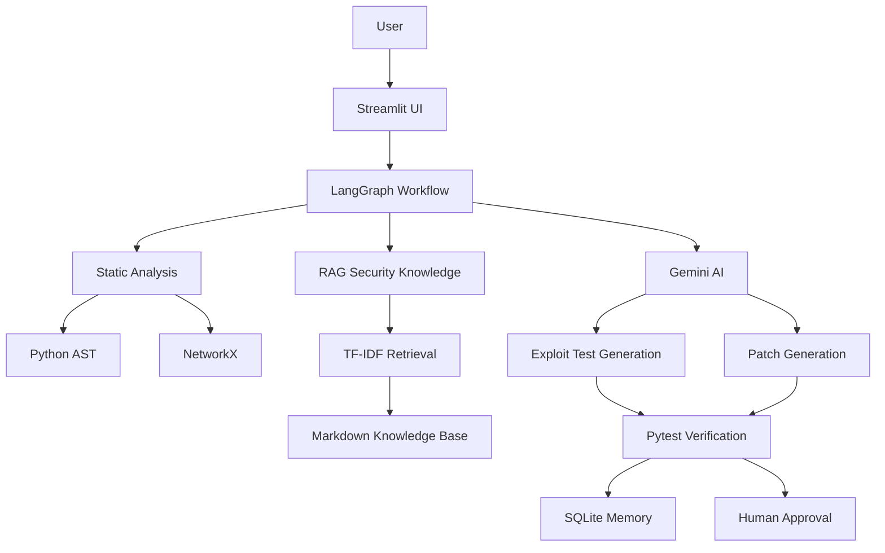

<div align="center">

# 🛡️ AegisGuard

### AI-Assisted Vulnerability Detection, Remediation & Verification

**Finds • Proves • Fixes • Verifies — with a human in control**

<br>


<br>

### 🚀 From Vulnerability Detection to Verified Remediation

AegisGuard combines **static analysis, multi-agent AI, RAG, automated verification, long-term memory, and human approval** into one application-security workflow.

<br>

[](https://aegisguard-ai.streamlit.app/)
[](https://github.com/habibaume2007-creator/AegisGuard)

---

### 🧭 Project Navigator

[](#overview)
[](#the-problem)
[](#core-workflow)
[](#key-features)

[](#technology-stack)
[](#system-architecture)
[](#multi-agent-workflow)
[](#installation--setup)

[](#deployment)
[](https://aegisguard-ai.streamlit.app/)
[](#security-notes)
[](#team)

---

### ⚡ Core Security Flow

**TRIAGE → EXPLOIT → CONFIRM → PATCH → VERIFY → HUMAN APPROVAL**

| 🔍 Detect | 🧪 Prove | 🧠 Retrieve | 🔧 Patch | ✅ Verify | 👤 Approve |
|---|---|---|---|---|---|
| Static Analysis | Exploit Test | RAG Guidance | Gemini | Pytest | Human Review |

> **AI may propose the fix. Evidence should verify it. Humans should approve it.**

</div>

---

## Overview

AegisGuard is an AI-assisted application-security prototype designed to move beyond traditional vulnerability detection.

Traditional security tools often focus on:

**Detect → Report**

AegisGuard extends that workflow to:

**Detect → Prove → Retrieve Security Knowledge → Patch → Verify → Remember → Human Approve**

The platform combines:

- 🛡️ Static source-code analysis
- 🤖 Multi-agent workflow orchestration
- 🧠 Retrieval-Augmented Generation
- 🧪 AI-generated security tests
- 🔧 AI-assisted remediation
- ✅ Automated verification
- 💾 Persistent security memory
- 👤 Human-in-the-loop approval

AegisGuard demonstrates how AI can support a more structured, test-driven, and evidence-based remediation workflow while keeping the final decision under human control.

---

## The Problem

Finding a vulnerability is only the beginning.

Traditional security scanners may identify risky code, but developers still need to:

- Determine whether the issue is actually exploitable
- Understand the vulnerable execution path
- Reproduce the vulnerability
- Research the correct remediation
- Write a secure patch
- Test whether the patch blocks the attack
- Ensure existing functionality still works
- Review and approve the final code change

AI coding assistants can generate fixes quickly, but an AI-generated patch should not be considered secure simply because it looks correct.

**A security fix must be verified.**

---

## The Solution

AegisGuard provides a structured remediation pipeline:

**TRIAGE → EXPLOIT → CONFIRM → PATCH → VERIFY → HUMAN APPROVAL**

It attempts to answer six key questions:

1. **Where is the risky code?**
2. **Can the vulnerability be reproduced?**
3. **What security guidance is relevant?**
4. **What remediation should be proposed?**
5. **Does the remediation actually work?**
6. **Should a human approve the final change?**

---

## Core Workflow

AegisGuard follows a concise six-stage remediation process:

**TRIAGE → EXPLOIT → CONFIRM → PATCH → VERIFY → HUMAN APPROVAL**

### 1. Triage
Uses **Python AST + NetworkX** to detect risky code, identify the vulnerable function, and inspect reachability.

### 2. Exploit
Uses **Gemini** to generate a targeted security regression test for trusted demo samples.

### 3. Confirm
Runs the generated test to confirm whether the suspected vulnerability can be reproduced.

### 4. Patch
Retrieves relevant **RAG security guidance** and uses Gemini to propose a remediation.

### 5. Verify
Uses **Pytest + static re-checking** to confirm that the attack is blocked and existing functionality still works.

### 6. Human Approval
Presents the verified remediation for final human review and approval.

### Core Concept

**🔴 RED → PATCH → 🟢 GREEN**

- **RED:** Vulnerability reproduced
- **PATCH:** Remediation generated
- **GREEN:** Security and regression tests pass

---

## Key Features

- 🛡️ Static security scanning
- 📁 Python file and ZIP project upload
- 🤖 Multi-agent remediation workflow
- 🧠 RAG-grounded security guidance
- 🧪 AI-generated exploit tests
- 🔧 AI-assisted patch generation
- ✅ Automated security verification
- 🧾 Regression testing
- 💾 Long-term security memory
- 👤 Human-in-the-loop approval
- 📊 Run history
- 💬 Security Assistant

---

## Technology Stack

| Layer | Technology | Purpose |
|---|---|---|
| User Interface | **Streamlit** | Security dashboard, project upload, assistant, run history |
| Agent Orchestration | **LangGraph** | Workflow state, routing, retries, and stage coordination |
| AI | **Google Gemini** | Exploit-test and patch generation |
| AI Integration | **LangChain Google GenAI** | Connects AegisGuard with Gemini |
| Static Analysis | **Python AST** | Parses Python source code and detects risky patterns |
| Graph Analysis | **NetworkX** | Call-graph and reachability analysis |
| RAG | **TF-IDF** | Retrieves relevant security guidance |
| Knowledge Base | **Markdown files** | Stores defensive security knowledge |
| Testing | **Pytest** | Security and regression verification |
| Memory | **SQLite** | Stores previous runs, outcomes, failures, and fixes |
| Demo Applications | **Flask** | Trusted sample applications |
| UI Theme | **Custom CSS + Streamlit Theme** | Professional application interface |

---

## System Architecture



### How the Backend Components Work Together

AegisGuard connects each backend component into one remediation workflow rather than treating them as separate utilities.

| Component | Role in AegisGuard |
|---|---|
| **Streamlit UI** | Receives user input, uploads, workflow actions, and displays results |
| **LangGraph** | Orchestrates the complete workflow and controls transitions between stages |
| **Python AST** | Parses Python code and identifies suspicious or unsafe patterns |
| **NetworkX** | Analyzes function relationships and reachability |
| **Google Gemini** | Generates targeted exploit tests and proposed patches |
| **TF-IDF RAG** | Retrieves relevant defensive security guidance |
| **Markdown Knowledge Base** | Stores local security guidance |
| **Pytest** | Executes exploit tests and regression tests |
| **Static Re-check** | Checks whether the insecure pattern remains after remediation |
| **SQLite Memory** | Stores successful and failed runs, previous attempts, and outcomes |
| **Human Approval** | Keeps the final remediation decision under developer control |

### Backend Flow

**User → Streamlit → LangGraph → Static Analysis → Exploit Generation → RAG-Guided Patch → Pytest Verification → SQLite Memory → Human Approval**

### RAG and Patch Connection

**Detected Vulnerability → TF-IDF Retrieval → Relevant Security Guidance → Gemini → Grounded Patch Suggestion**

### Verification Loop

**Generated Patch → Exploit Test + Regression Tests + Static Re-check → PASS / FAIL**

- **PASS:** Ready for human approval
- **FAIL:** Retry or revise the remediation

> **AegisGuard creates a closed remediation loop: Analyze → Prove → Retrieve → Patch → Verify → Remember → Approve.**

---

## Multi-Agent Workflow

AegisGuard uses **LangGraph** to organize the remediation process into specialized stages.

**Triage → Exploit → Confirmation → Patch → Verification → Record / Memory → Human Approval**

### Triage Stage
- Detects supported vulnerabilities
- Identifies the vulnerable function
- Determines vulnerability type
- Checks reachability

### Exploit Stage
- Generates targeted security regression tests
- Attempts to reproduce the vulnerability

### Confirmation Stage
- Executes the security test
- Determines whether the expected vulnerability behavior occurs

### Patch Stage
- Retrieves relevant security guidance
- Uses available memory context
- Generates a proposed remediation

### Verification Stage
- Re-runs the exploit test
- Runs original regression tests
- Performs static re-checking

### Memory Stage
Stores:

- Vulnerability type
- Function
- Exploit test
- Proposed patch
- Verification result
- Previous failures
- Successful fixes

---

## RAG Implementation

AegisGuard uses **Retrieval-Augmented Generation (RAG)** primarily during patch generation and in the Security Assistant.

### RAG Flow

**Detected Vulnerability → Query Knowledge Base → TF-IDF Retrieval → Relevant Security Guidance → Vulnerable Code + Guidance → Gemini → Grounded Patch Suggestion**

The local knowledge base includes guidance for:

- SQL Injection
- Path Traversal
- Cross-Site Scripting
- Unsafe Deserialization

RAG helps provide vulnerability-specific defensive context before Gemini generates a remediation.

The same retrieval layer also supports the **Security Assistant**.

---

## Supported Vulnerabilities

The current prototype includes trusted demonstration scenarios for:

- SQL Injection
- Path Traversal
- Cross-Site Scripting (XSS)

The security knowledge base also includes defensive guidance for:

- Unsafe Deserialization

> AegisGuard is a prototype and should not be presented as a complete replacement for mature SAST, DAST, or enterprise application-security platforms.

---

## Project Structure

```text
AegisGuard/
│
├── app.py
├── agent.py
├── assistant.py
├── check_setup.py
├── config.py
├── graph_builder.py
├── memory.py
├── project_loader.py
├── rag.py
├── sandbox.py
├── scanner.py
├── ui_common.py
│
├── .streamlit/
│   └── config.toml
│
├── views/
│   ├── demo.py
│   ├── assistant.py
│   ├── memory_page.py
│   └── team.py
│
├── knowledge/
│   ├── aegisguard_overview.md
│   ├── path_traversal.md
│   ├── sql_injection.md
│   ├── unsafe_deserialization.md
│   └── xss.md
│
├── samples/
│   ├── path_traversal/
│   ├── sql_injection/
│   └── xss/
│
├── requirements.txt
├── .env.example
├── .gitignore
├── about.json
└── README.md
```

---

## Requirements

### Recommended Environment

- Python **3.12**
- pip
- Git
- Internet connection for Gemini API access

### Main Python Dependencies

- `langgraph`
- `langchain-google-genai`
- `networkx`
- `flask`
- `pytest`
- `streamlit`
- `python-dotenv`
- `docker`

All required dependencies are listed in `requirements.txt`.

---

## Installation & Setup

### 1. Clone the Repository

```bash
git clone https://github.com/habibaume2007-creator/AegisGuard.git
cd AegisGuard
```

### 2. Create a Virtual Environment

```powershell
py -3.12 -m venv .venv
```

Activate it:

```powershell
.\.venv\Scripts\Activate.ps1
```

Verify:

```powershell
python --version
```

Expected:

```text
Python 3.12.x
```

### 3. Install Dependencies

```powershell
python -m pip install -r requirements.txt
```

### 4. Configure Environment Variables

Copy `.env.example` to `.env`.

Example:

```env
GOOGLE_API_KEY=your_gemini_api_key_here
GEMINI_MODEL=your_primary_model_here
GEMINI_FALLBACK_MODEL=your_fallback_model_here
USE_DOCKER=false
MAX_ATTEMPTS=3
LOW_TOKEN_MODE=true
```

> Never commit your real `.env` file or API key to GitHub.

### 5. Verify the Setup

```powershell
python check_setup.py
```

A successful setup should verify:

- Package imports
- Environment configuration
- Regression tests
- Sandbox behavior
- Gemini connectivity

---

## Run the Application

Start AegisGuard with:

```powershell
streamlit run app.py
```

Streamlit should open the application in your browser.

---

## Deployment

AegisGuard is deployed using **Streamlit Community Cloud**.

### 🌐 Live Application

[](https://aegisguard-ai.streamlit.app/)

**Live URL:**  
https://aegisguard-ai.streamlit.app/

### Deployment Configuration

- **Platform:** Streamlit Community Cloud
- **Repository:** `habibaume2007-creator/AegisGuard`
- **Branch:** `main`
- **Main file:** `app.py`
- **Python version:** `3.12`
- **Docker mode:** Disabled for cloud deployment
- **Gemini API:** Configured using Streamlit Secrets

### Streamlit Secrets

```toml
GOOGLE_API_KEY = "YOUR_GEMINI_API_KEY"
GEMINI_MODEL = "your_primary_model"
GEMINI_FALLBACK_MODEL = "your_fallback_model"
USE_DOCKER = "false"
MAX_ATTEMPTS = "3"
LOW_TOKEN_MODE = "true"
```

> API keys and credentials should never be committed to GitHub. They should be stored securely in Streamlit Community Cloud Secrets.

### Deployment Flow

**GitHub Repository → Streamlit Community Cloud → Install Dependencies → Load Secrets → Run `app.py` → Public AegisGuard Web App**

### Cloud Security Note

In the deployed environment, AegisGuard keeps `USE_DOCKER=false`.

Unknown uploaded third-party projects should therefore be handled through **static analysis only** and should not be executed directly.

The full **exploit → patch → verify** workflow is intended for trusted bundled demonstration samples.

---

## Live Demo

### 🌐 AegisGuard Web Application

[](https://aegisguard-ai.streamlit.app/)

**Live Application:**  
https://aegisguard-ai.streamlit.app/

### 💻 GitHub Repository

https://github.com/habibaume2007-creator/AegisGuard

---

## Security Notes

AegisGuard distinguishes between trusted demonstration samples and uploaded third-party projects.

### Trusted Bundled Samples

Trusted samples can use the complete workflow:

**Detect → Exploit → Confirm → Patch → Verify**

### Uploaded Third-Party Projects

When isolated sandboxing is unavailable:

**Upload → Safe Extraction → Static Analysis → Security Findings**

Unknown uploaded projects are not intended to be executed directly in local or cloud mode without proper isolation.

This reduces the risk of executing untrusted source code.

---

## Future Roadmap

Planned improvements include:

- GitHub Pull Request integration
- CI/CD security integration
- Docker/cloud sandbox isolation
- Additional vulnerability classes
- Multi-language source-code analysis
- More advanced RAG
- Improved long-term security memory
- Automated secure-remediation workflows
- Advanced security reporting
- Security policy integration

---

## Team

### Aegis Aspire — AegisGuard Team

Developed for the **Final Term Hackathon — Aspire Pakistan Cohort 11**

| Team Member | Role | Main Contribution |
|---|---|---|
| **Um e Habiba** | **Team Leader, Lead Developer & System Architect** | Overall architecture, backend integration, LangGraph workflow, RAG integration, system design, coordination, and final integration |
| **Hyder Ali** | **Technical Contributor — AI & Agent Orchestration** | AI workflow support, agent architecture, and technical implementation |
| **Muhammad Ammar Khan** | **Software Engineering, UI/UX & Testing Contributor** | Backend support, UI/UX improvements, testing, debugging, and verification |
| **Syed Muaviz ur Rehman** | **Technical Contributor & Verification Support** | Technical development, GitHub/documentation support, sandbox and verification support |
| **Filza Syed** | **Presentation & Junior Technical Contributor** | Presentation design, security-content support, testing assistance, and project presentation preparation |
| **Hina Saeed** | **Demo & Documentation Lead** | Demo video, project documentation, pitch support, and presentation of the application workflow |

### Team Goal

The team collaborated to build AegisGuard as an **AI-assisted secure-code remediation prototype** combining static analysis, multi-agent orchestration, RAG-based security guidance, automated verification, long-term memory, and human oversight.

> **Built by Aegis Aspire — combining AI, software engineering, cybersecurity, testing, and human oversight into one verified remediation workflow.**

---

## Security Philosophy

> **AI may propose the fix. Evidence should verify it. Humans should approve it.**

AegisGuard is built around the principle that AI can assist application security, but verification and human oversight should remain central to the remediation process.

---

## Final Vision

Traditional workflow:

**Detect → Alert → Manual Investigation**

AegisGuard workflow:

**Detect → Prove → Retrieve Security Knowledge → Generate Fix → Verify → Remember → Human Approves**

---

<div align="center">

# 🛡️ AegisGuard

### From Vulnerability Detection to Verified Remediation

[](https://aegisguard-ai.streamlit.app/)
[](https://github.com/habibaume2007-creator/AegisGuard)

</div>
